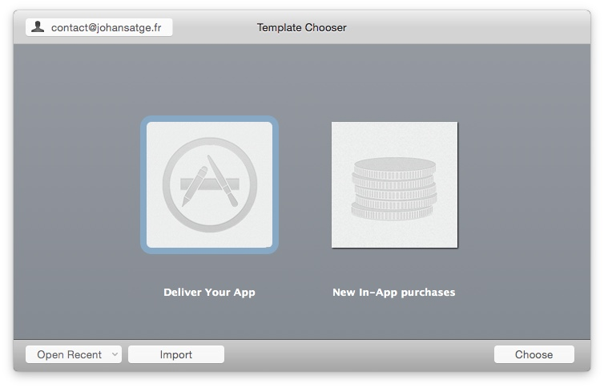
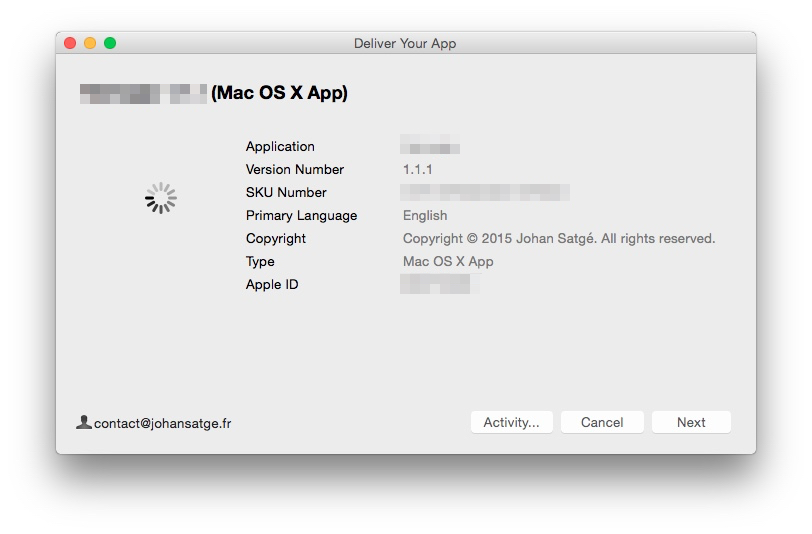

### Creating a package

To upload the signed app, you have to bundle it in a `.pkg` file.

To do so, run the following command:

TODO: where to get the identity?

```bash
export IDENTITY=LK12345678
export APP_DIR=/path/to/yourapp/
export APP_NAME=yourapp
cd $APP_DIR && productbuild --component "$APP_NAME.app" /Applications --sign $IDENTITY "$APP_NAME.pkg"
```

`productbuild` uses your `Installer` identity, not the `App` identity.

### Uploading

Open `/Applications/Xcode.app/Contents/Applications/Application Loader.app`, and choose *Deliver your app*:



In the file dialog, select your `.pkg` file. Then, check that the informations are correct:



Click on *Next*.

The loader will perform the first, automated validation (checking the app signature, the icon...), then it will start uploading it.

### Validating the package

Go to iTunes Connect and open your app panel.

In the *Build* section, you will be able to select the binary.

*You may have to wait a few minutes when your package has been uploaded, before being able to select it.*